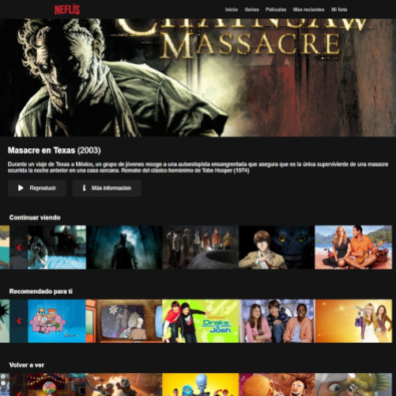

# Neflis

Netflix style app using tmdb images and preprocessors

Very simple site, the priority here was learn how to use webpack, loaders and plugins

In a future i could add other of my favourite technologies as fetch-api or vue cdn.

https://awesome-mclean-beb431.netlify.app/

## Stack

- templates with pug
- styles with stylus and [stylus-kit](https://github.com/LuisOlive/stylus-kit)
- vanilla JavaScript carousels
- webpack bundler
- service workers with workbox-plugin
- data using yaml files
